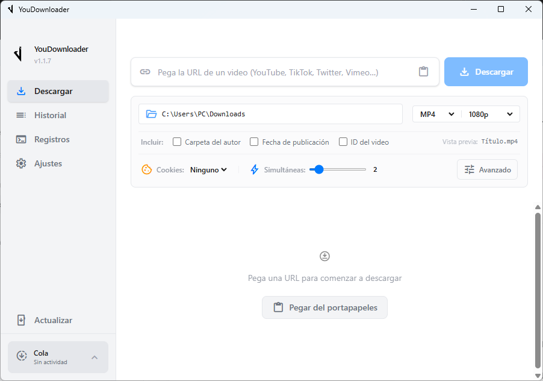
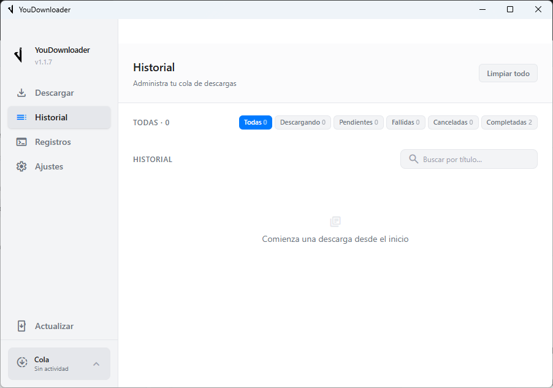

# YouDownloader

Aplicación de escritorio para descargar vídeos y listas de reproducción con [yt-dlp](https://github.com/yt-dlp/yt-dlp). Está construida con Tauri, Rust y SvelteKit.



## Funciones

- Descarga de vídeos y listas de reproducción.
- Selección de formato y calidad.
- Cola de descargas con cancelación y reintentos.
- Historial de descargas y búsqueda.
- Soporte de cookies para contenido que requiere sesión.
- Interfaz en varios idiomas y temas claro y oscuro.
- Actualización del portable de Windows desde la aplicación.

## Ejecutar en desarrollo

Requisitos: Node.js, Rust, Microsoft C++ Build Tools y WebView2 en Windows.

```powershell
npm ci --ignore-scripts
npm.cmd run desktop
```

También puedes iniciar el proyecto con `npm run desktop` si PowerShell permite ejecutar scripts.

## Portable para Windows

Para generar la versión portable:

```powershell
npm ci --ignore-scripts
npm run build:portable
```

El resultado se crea en `portable/`. Conserva toda la carpeta portable para mantener la configuración, el historial y las herramientas incluidas.

## Capturas

### Descargador


### Historial



## Desarrollo

Las versiones publicadas para Windows se encuentran en [GitHub Releases](https://github.com/replayfix/YouDownloader/releases). Los cambios de código se publican mediante GitHub Actions.

## Créditos

YouDownloader utiliza estos proyectos de código abierto:

- [yt-dlp](https://github.com/yt-dlp/yt-dlp)
- [FFmpeg](https://ffmpeg.org)
- [Deno](https://github.com/denoland/deno)

El proyecto está basado en [Yummy-Yt-Dlp](https://github.com/shlifedev/Yummy-Yt-Dlp).

## Licencia

Este proyecto se distribuye bajo la [licencia MIT](LICENSE).
